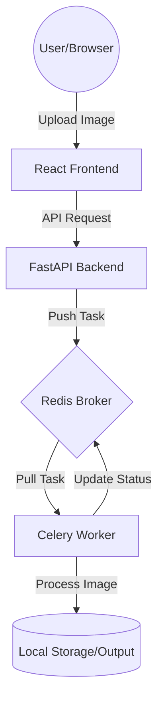

[](https://github.com/jasenalfatamaa/image_processing/actions/workflows/ci-backend.yml)

# 📸 Image Processing System with FastAPI & Celery


Sistem pengolahan gambar asinkron yang tangguh menggunakan **FastAPI**, **Celery**, dan **Redis**. Proyek ini mendemonstrasikan implementasi *background tasks*, Docker orchestration, dan otomatisasi pengujian (QA Automation).

## 🚀 Fitur Utama
- **Asynchronous Processing**: Upload gambar dan biarkan sistem memprosesnya di background tanpa memblokir API.
- **Dockerized**: Seluruh stack (Frontend, Backend, Worker, Redis) sudah dikontainerisasi.
- **QA Automation**: Dilengkapi dengan Unit Testing otomatis menggunakan `pytest` dan GitHub Actions.
- **Modern Tech Stack**: React (Frontend), FastAPI (Backend), dan Celery (Task Queue).

## 🏗️ Arsitektur Sistem


## 🛠️ Instalasi & Penggunaan Lokal

### Prasyarat
- Docker & Docker Compose

### 🔑 Konfigurasi Environment (.env)
Buat file bernama `.env` di dalam folder `backend/` dan masukkan konfigurasi berikut untuk dijalankan di lokal:

```env
REDIS_URL=redis://localhost:6379
BACKEND_PORT:8000
```

### Langkah-langkah
1. Clone repository ini:
   ```bash
   git clone [https://github.com/jasenalfatamaa/image_processing.git](https://github.com/jasenalfatamaa/image_processing.git)
   cd image_processing
2. Jalankan aplikasi menggunakan Docker Compose:
   ```bash
   docker-compose up --build
3. Akses aplikasi:
   Frontend: http://localhost:3000
   Backend: http://localhost:8000