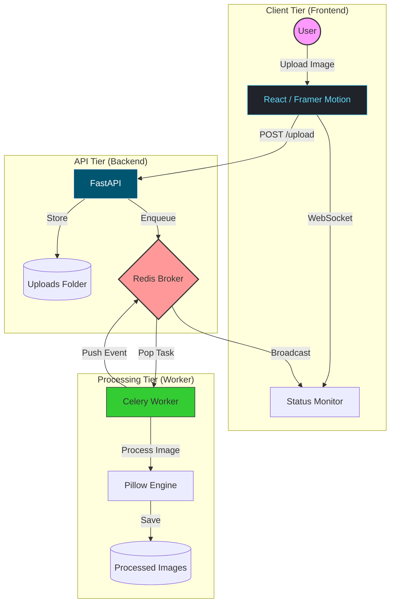

# 💎 NeoImage: Neural Processing Engine

[](https://github.com/jasenalfatamaa/image_processing/actions/workflows/ci.yml)


**NeoImage** adalah platform pengolahan gambar *high-fidelity* yang menggabungkan kecepatan **FastAPI**, ketangguhan **Celery**, dan desain **Premium React**. Dirancang dengan arsitektur asinkron yang terdistribusi untuk menangani tugas pemrosesan gambar yang berat tanpa mengorbankan pengalaman pengguna.

---

## ✨ Fitur Unggulan

- 🧠 **Neural Upscale**: Resampling gambar cerdas untuk meningkatkan resolusi (HD support).
- 🌓 **Deep Monochrome**: Konversi grayscale dengan kontras tinggi yang artistik.
- ⚡ **Smart Optimization**: Kompresi cerdas yang menjaga integritas visual namun mengurangi ukuran file secara signifikan.
- 🔄 **Real-time Engine**: Menggunakan **WebSockets** untuk pembaruan status pemrosesan secara instan langsung dari worker.
- 📥 **Forced Download**: Fitur unduhan langsung (Save As) untuk hasil transformasi.
- 🎭 **Demo Mode Proxy**: Deteksi cerdas status backend yang memungkinkan UI tetap interaktif via simulasi saat offline.
- 🧪 **Build Guard**: Integrasi testing otomatis di Docker build stage untuk menjamin kualitas kode produksi.

---

## 🏗️ Arsitektur Sistem

NeoImage menggunakan arsitektur *Decoupled Distributed* yang menjamin skalabilitas tinggi.


```mermaid
graph TD
    %% Client Tier
    subgraph "Client Tier (Frontend)"
        User((User)) -->|Upload Image| React[React / Framer Motion]
        React -->|WebSocket| WS[Status Monitor]
    end

    %% API Tier
    subgraph "API Tier (Backend)"
        React -->|POST /upload| FastAPI[FastAPI]
        FastAPI -->|Store| Disk[(Uploads Folder)]
        FastAPI -->|Enqueue| Redis{Redis Broker}
    end

    %% Processing Tier
    subgraph "Processing Tier (Worker)"
        Redis -->|Pop Task| Worker[Celery Worker]
        Worker -->|Process Image| Pillow[Pillow Engine]
        Pillow -->|Save| Results[(Processed Images)]
        Worker -->|Push Event| Redis
        Redis -->|Broadcast| WS
    end

    %% Visual Styling
    style User fill:#f9f,stroke:#333,stroke-width:2px
    style Redis fill:#ff9999,stroke:#333,stroke-width:2px
    style FastAPI fill:#005571,stroke:#fff,color:#fff
    style React fill:#20232a,stroke:#61DAFB,color:#61DAFB
    style Worker fill:#33cc33,stroke:#333
```

---

## �️ Tech Stack

### Frontend
- **React 18** + **Vite**
- **Tailwind CSS** (Premium Glassmorphism Design)
- **Framer Motion** (High-end micro-animations)
- **Vitest** + **React Testing Library**

### Backend & Worker
- **FastAPI** (High-performance API)
- **Celery** (Distributed Task Queue)
- **Redis** (Message Broker & Result Backend)
- **Pillow** (Image Processing Library)
- **Pytest** + **Httpx** (Automated QA)

### Infrastructure
- **Docker & Docker Compose** (Containerization)
- **GitHub Actions** (Unified CI/CD Pipeline)

---

## 🚀 Quick Start

### Menggunakan Docker (Rekomendasi)

Pastikan Anda telah menginstal **Docker Desktop**.

1. **Clone Repo**
   ```bash
   git clone https://github.com/jasenalfatamaa/image_processing.git
   cd image_processing
   ```

2. **Jalankan Cluster**
   ```bash
   docker-compose up --build
   ```

3. **Akses Dashboard**
   - **Frontend**: `http://localhost:3000`
   - **API Docs (Swagger)**: `http://localhost:8000/docs`

---

## 🧪 Testing & Quality Assurance

Proyek ini telah mengimplementasikan **Build-Stage Testing**. Kode tidak akan bisa di-build menjadi container image jika tes gagal.

### Menjalankan Tes Secara Manual
- **Backend**: `cd backend && python -m pytest tests/`
- **Frontend**: `cd frontend && npm run test`

---

## 🗺️ Roadmap
- [ ] Integrasi AI Upscaling (Local Model / OpenAI).
- [ ] Cloud Storage (AWS S3 / Supabase Storage).
- [ ] Batch Processing (Multiple images upload).
- [ ] User Authentication & Workspace.

---
Created with 💎 by **Jasen Alfatama**