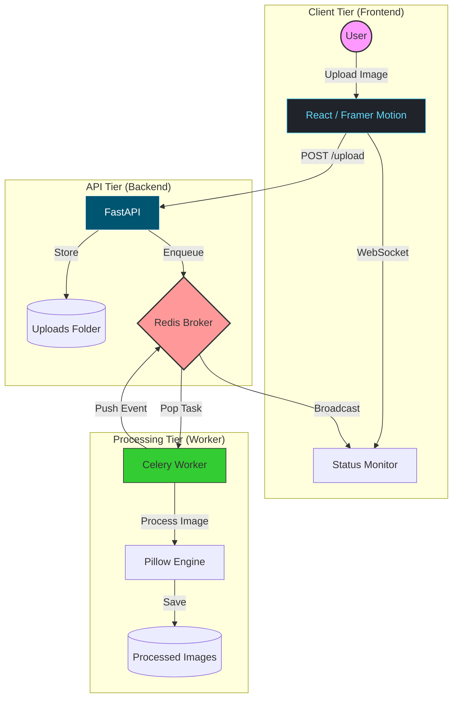

# 💎 NeoImage: Neural Processing Engine

[](https://github.com/jasenalfatamaa/image_processing/actions/workflows/ci.yml)
[](https://neoimage.vercel.app)


**NeoImage** is a high-fidelity image processing platform that combines the speed of **FastAPI**, the robustness of **Celery**, and the elegance of **Premium React**. It is designed with a distributed asynchronous architecture to handle heavy image processing tasks without compromising the user experience.

---

## ✨ Key Features

- 🧠 **Neural Upscale**: Intelligent image resampling to increase resolution (HD support).
- 🌓 **Deep Monochrome**: Artistic grayscale conversion with high contrast.
- ⚡ **Smart Optimization**: Intelligent compression that preserves visual integrity while significantly reducing file size.
- 🔄 **Real-time Engine**: Uses **WebSockets** for instant processing status updates directly from the worker.
- 📥 **Forced Download**: Direct download feature (Save As) for transformation results.
- 🎭 **Demo Mode Proxy**: Intelligent backend status detection that allows the UI to remain interactive via simulation when offline.
- 🧪 **Build Guard**: Integration of automated testing in the Docker build stage to ensure production code quality.

---

## 🏗️ System Architecture

NeoImage utilizes a *Decoupled Distributed* architecture to ensure high scalability.


```mermaid
graph TD
    %% Client Tier
    subgraph "Client Tier (Frontend)"
        User((User)) -->|Upload Image| React[React / Framer Motion]
        React -->|WebSocket| WS[Status Monitor]
    end

    %% API Tier
    subgraph "API Tier (Backend)"
        React -->|POST /upload| FastAPI[FastAPI]
        FastAPI -->|Store| Disk[(Uploads Folder)]
        FastAPI -->|Enqueue| Redis{Redis Broker}
    end

    %% Processing Tier
    subgraph "Processing Tier (Worker)"
        Redis -->|Pop Task| Worker[Celery Worker]
        Worker -->|Process Image| Pillow[Pillow Engine]
        Pillow -->|Save| Results[(Processed Images)]
        Worker -->|Push Event| Redis
        Redis -->|Broadcast| WS
    end

    %% Visual Styling
    style User fill:#f9f,stroke:#333,stroke-width:2px
    style Redis fill:#ff9999,stroke:#333,stroke-width:2px
    style FastAPI fill:#005571,stroke:#fff,color:#fff
    style React fill:#20232a,stroke:#61DAFB,color:#61DAFB
    style Worker fill:#33cc33,stroke:#333
```

---

## 🛠️ Tech Stack

### Frontend
- **React 18** + **Vite**
- **Tailwind CSS** (Premium Glassmorphism Design)
- **Framer Motion** (High-end micro-animations)
- **Vitest** + **React Testing Library**

### Backend & Worker
- **FastAPI** (High-performance API)
- **Celery** (Distributed Task Queue)
- **Redis** (Message Broker & Result Backend)
- **Pillow** (Image Processing Library)
- **Pytest** + **Httpx** (Automated QA)

### Infrastructure
- **Docker & Docker Compose** (Containerization)
- **GitHub Actions** (Unified CI/CD Pipeline)

---

## 🚀 Quick Start

### Using Docker (Recommended)

Make sure you have **Docker Desktop** installed.

1. **Clone Repo**
   ```bash
   git clone https://github.com/jasenalfatamaa/image_processing.git
   cd image_processing
   ```

2. **Run Cluster**
   ```bash
   docker-compose up --build
   ```

3. **Access Dashboard**
   - **Frontend**: `http://localhost:3000`
   - **API Docs (Swagger)**: `http://localhost:8000/docs`
   - **Live Demo (Frontend Only)**: [neoimage.vercel.app](https://neoimage.vercel.app)

---

## 🧪 Testing & Quality Assurance

This project implements **Build-Stage Testing**. Code cannot be built into a container image if tests fail.

### Running Tests Manually
- **Backend**: `cd backend && python -m pytest tests/`
- **Frontend**: `cd frontend && npm run test`

---

## 🗺️ Roadmap
- [ ] AI Upscaling Integration (Local Model / OpenAI).
- [ ] Cloud Storage (AWS S3 / Supabase Storage).
- [ ] Batch Processing (Multiple images upload).
- [ ] User Authentication & Workspace.

---
Created with 💎 by **Jasen Alfatama**